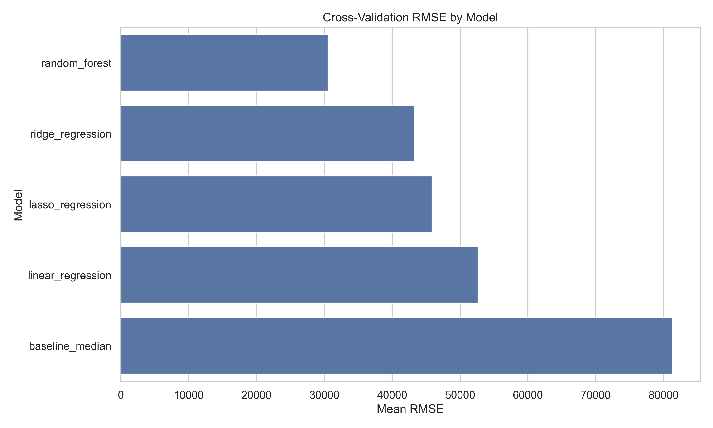
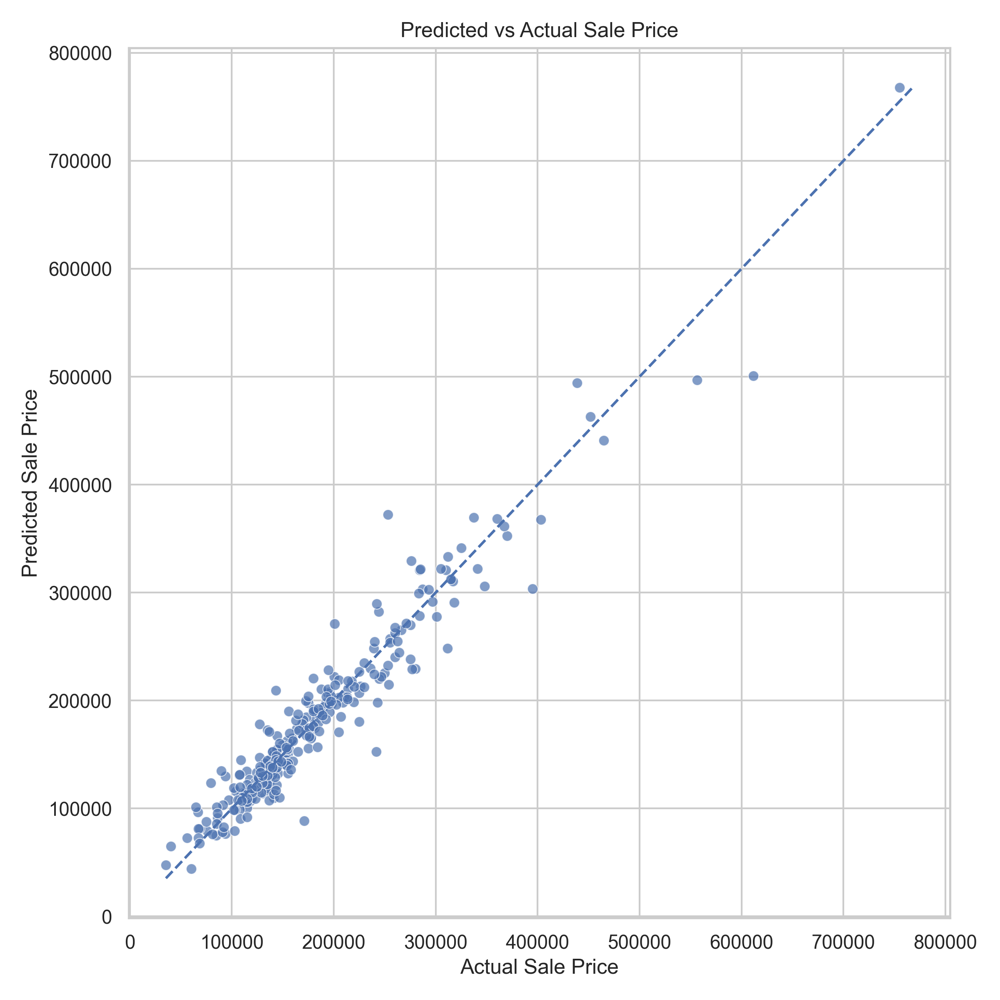
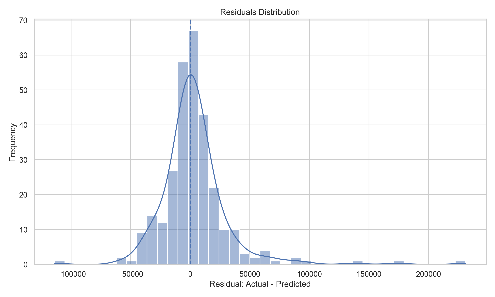
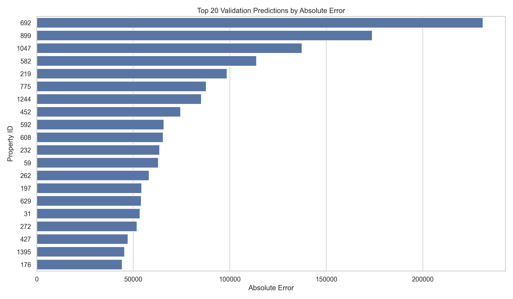
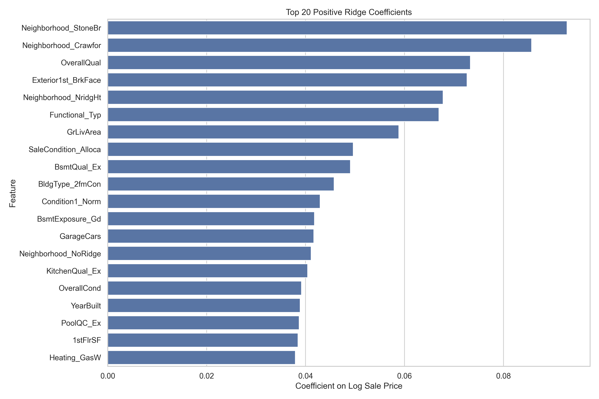
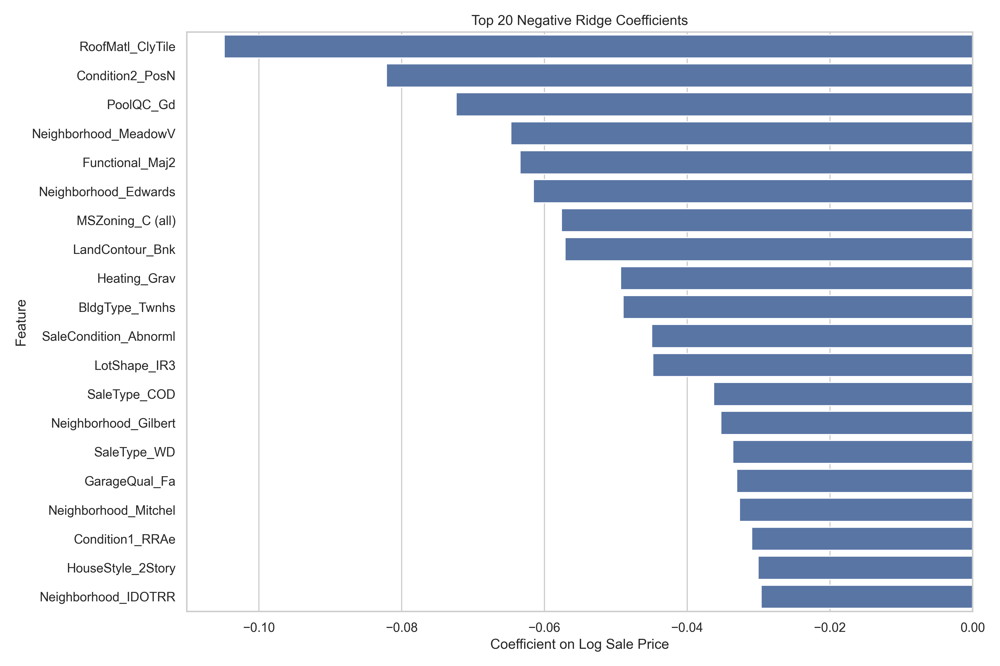

# House Prices Regression: Predicting Property Prices with Interpretable Machine Learning

## Overview

This project builds and evaluates regression models to estimate residential property sale prices using structured housing data.

The goal is not only to predict prices, but also to evaluate model stability, analyze prediction errors, and interpret the property characteristics associated with price.

---

## Business Context

Residential property pricing depends on multiple factors such as location, living area, construction quality, condition, garage capacity, basement quality, and sale characteristics.

A regression model can support pricing decisions, identify value drivers, and flag properties where automated estimates may require manual review.

This model should be used as a decision-support tool, not as an automatic valuation authority.

---

## Dataset

This project uses the **House Prices - Advanced Regression Techniques** dataset from Kaggle.

The dataset contains residential property data with features related to:

- property size,
- quality and condition,
- neighborhood,
- basement and garage characteristics,
- year built and remodeling,
- sale type and sale condition.

The target variable is:

```text
SalePrice
```

Because `SalePrice` is right-skewed, models were trained using:

```text
SalePriceLog = log1p(SalePrice)
```

Predictions were converted back to the original price scale for evaluation.

> Note: Raw Kaggle data files are not included in this repository. Users must download `train.csv`, `test.csv`, and `data_description.txt` from Kaggle and place them in `data/raw/`.

---

## Project Structure

```text
house-prices-regression/
├── data/
│   ├── raw/
│   └── processed/
├── models/
├── notebooks/
│   └── 01_regression_modeling.ipynb
├── reports/
│   ├── executive_summary_en.md
│   ├── resumen_ejecutivo_es.md
│   ├── model_metrics.csv
│   ├── cross_validation_summary.csv
│   ├── final_model_selection.csv
│   └── figures/
├── src/
│   ├── audit_data.py
│   ├── cross_validate_models.py
│   ├── evaluate_models.py
│   ├── interpret_model.py
│   ├── load_data.py
│   ├── preprocess_data.py
│   └── train_models.py
├── README.md
├── requirements.txt
└── .gitignore
```

---

## Methodology

The project follows a reproducible machine learning workflow:

1. Load raw Kaggle data.
2. Audit missing values, feature types, target distribution, and correlations.
3. Create train and validation splits.
4. Handle missing values using feature-specific rules.
5. Encode categorical variables using one-hot encoding.
6. Train multiple regression models.
7. Compare models with validation metrics and cross-validation.
8. Select a final predictive model.
9. Analyze prediction errors.
10. Interpret feature associations using Ridge coefficients.

---

## Models Compared

| Model | Purpose |
|---|---|
| Median Baseline | Minimum benchmark |
| Linear Regression | Simple interpretable model |
| Ridge Regression | Regularized linear model |
| Lasso Regression | Sparse regularized linear model |
| Random Forest Regressor | Nonlinear ensemble model |

---

## Key Results

### 1. Single validation split favored Linear Regression

On the initial validation split, Linear Regression achieved the lowest RMSE.

| Model | MAE | RMSE | R² |
|---|---:|---:|---:|
| Linear Regression | 15,074.87 | 22,906.51 | 0.9316 |
| Ridge Regression | 16,434.82 | 25,110.06 | 0.9178 |
| Lasso Regression | 16,328.30 | 25,122.65 | 0.9177 |
| Random Forest | 17,349.97 | 29,673.74 | 0.8852 |
| Median Baseline | 59,568.25 | 88,667.17 | -0.0250 |

However, relying only on one validation split would be weak because the dataset is small and contains many one-hot encoded categorical variables.

---

### 2. Cross-validation changed the model decision

Cross-validation showed that Linear Regression was unstable across folds.

Random Forest achieved the best average RMSE and better stability.

| Model | Mean RMSE | RMSE Std | Mean R² |
|---|---:|---:|---:|
| Random Forest | 30,537.30 | 6,119.20 | 0.8508 |
| Ridge Regression | 43,337.81 | 36,656.64 | 0.5981 |
| Lasso Regression | 45,883.63 | 42,185.14 | 0.5240 |
| Linear Regression | 52,687.83 | 49,190.82 | 0.3637 |
| Median Baseline | 81,317.92 | 5,639.73 | -0.0565 |



---

## Final Model

The final predictive model is:

```text
Random Forest Regressor
```

This decision was based on cross-validation stability, not only on the best result from a single validation split.

Ridge Regression was used separately for interpretation because its regularized coefficients are easier to explain to stakeholders.

---

## Final Model Error Analysis

The final Random Forest model achieved:

| Metric | Value |
|---|---:|
| MAE | 17,349.97 |
| RMSE | 29,673.74 |
| R² | 0.8852 |
| Median absolute error | 9,980.23 |
| Mean absolute percentage error | 10.19% |
| Median absolute percentage error | 6.29% |

The largest errors are concentrated in higher-value or atypical properties.







---

## Model Interpretation

Ridge Regression coefficients suggest that the following factors are positively associated with sale price:

- premium neighborhoods,
- overall quality,
- above-ground living area,
- excellent basement quality,
- garage capacity,
- excellent kitchen quality,
- normal functionality.

Negative associations include:

- lower-value neighborhoods,
- abnormal sale conditions,
- certain zoning categories,
- functional issues,
- less desirable property characteristics.

These coefficients should be interpreted as associations, not causal effects. Some effects may be influenced by rare categories.





---

## Business Recommendations

1. Use the model as a pricing support tool, not as an automatic valuation system.
2. Review high-error predictions manually, especially for luxury or atypical properties.
3. Use Random Forest for predictive performance and Ridge coefficients for stakeholder communication.
4. Combine model outputs with local market knowledge before making pricing decisions.
5. Improve future models with location granularity, renovation details, market timing, comparable sales, and macroeconomic indicators.

---

## Reports

- [Executive Summary — English](reports/executive_summary_en.md)
- [Resumen Ejecutivo — Español](reports/resumen_ejecutivo_es.md)

---

## Notebook

- [Regression Modeling Notebook](notebooks/01_regression_modeling.ipynb)

---

## How to Reproduce This Project

### 1. Clone the repository

```bash
git clone https://github.com/RommelPa/house-prices-regression.git
cd house-prices-regression
```

### 2. Create and activate a virtual environment

```bash
py -m venv .venv
.venv\Scripts\activate
```

### 3. Install dependencies

```bash
pip install -r requirements.txt
```

### 4. Download Kaggle files

Download the dataset from Kaggle and place these files in `data/raw/`:

```text
train.csv
test.csv
data_description.txt
```

Expected structure:

```text
data/
└── raw/
    ├── train.csv
    ├── test.csv
    └── data_description.txt
```

### 5. Run the pipeline

```bash
python src/load_data.py
python src/audit_data.py
python src/preprocess_data.py
python src/train_models.py
python src/cross_validate_models.py
python src/evaluate_models.py
python src/interpret_model.py
```

### 6. Open the notebook

```bash
jupyter notebook notebooks/01_regression_modeling.ipynb
```

---

## Tools Used

- Python
- pandas
- numpy
- matplotlib
- seaborn
- scikit-learn
- joblib
- Jupyter Notebook
- Git
- GitHub

---

## Limitations

- The dataset is small for a high-dimensional regression problem.
- The Kaggle test set does not include true sale prices.
- Linear models were unstable under cross-validation due to high-dimensional one-hot encoded variables.
- The model does not include exact geographic coordinates, school district quality, interest rates, local demand, or comparable sales.
- Model interpretation is associative, not causal.
- Rare categorical levels may distort some coefficient-based interpretations.

---

## Next Steps

This project can be extended by:

- tuning Random Forest hyperparameters,
- comparing with Gradient Boosting or XGBoost,
- adding feature engineering for house age, remodeling age, and total living area,
- building a prediction API,
- creating a dashboard for pricing explanations.

---

## Spanish Summary

Este proyecto construye y evalúa modelos de regresión para estimar precios inmobiliarios usando datos estructurados de viviendas.

La validación simple favoreció a Linear Regression, pero la validación cruzada mostró que ese modelo era inestable. Por esa razón, el modelo final seleccionado fue Random Forest, mientras que Ridge Regression se usó para interpretar asociaciones entre variables y precio.

El proyecto incluye pipeline reproducible, comparación de modelos, validación cruzada, análisis de errores, interpretación de variables, notebook narrativo y reportes ejecutivos bilingües.